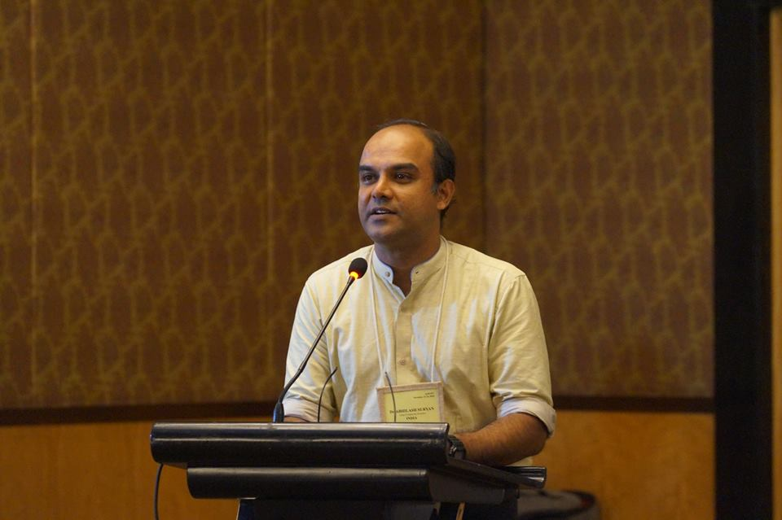

# asuryan.in

Official Website of Dr Abhilash Suryan

    

        

            

                

                    

                    

                        

                            
						

                        

                        

                            <h3 class="title">Abhilash Suryan</h3>
                            
Department of Mechanical Engineering

                            
College of Engineering Trivandrum

                            
Thiruvananthapuram - 695016

                            
Kerala, India

                            
&nbsp;

                            

                        

                    

                    

                    

                    

                        

                            <h2>Education</h2>
                        

                        <ul class="ul-card">
                            <li>
                                

                                    Ph.D.
                                    2012
                                

                                

                                    
Ph.D. Mechanical Engineering

                                    
Andong National University, South Korea

                                

                                

                            </li>
                            <li>
                                

                                    M.Tech.1997
                                

                                

                                    
Propulsion Engineering

                                    
College of Engineering Trivandrum

                                

                                

                            </li>
                            <li>
                                

                                    B.Tech.1995
                                

                                

                                    
Mechanical Engineering

                                    
College of Engineering Trivandrum

                                

                                

                            </li>
				<li>
                                

                                    International Engineering Educator2016
                                

                                

                                    
Engineering Education

                                    
IUCEE/Microsoft/IGIP

                                

                                

                            </li>
                        </ul>
                    

                

            

        

    

